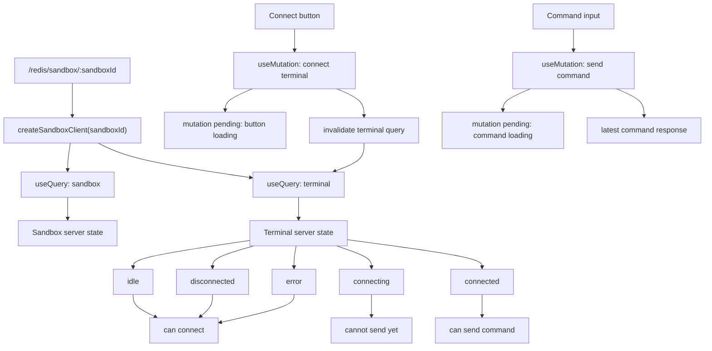
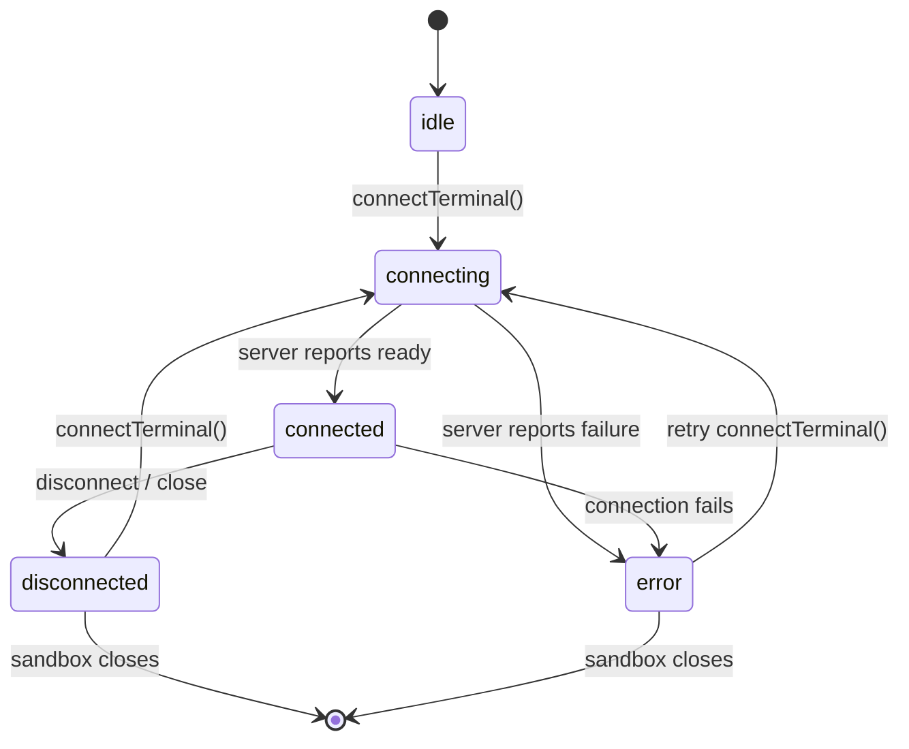
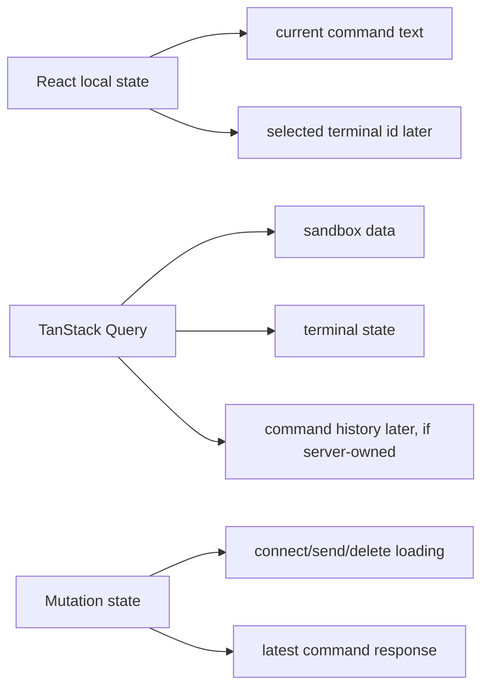

# Sandbox + Terminal V1

Simple setup: one sandbox owns one terminal. React Query owns server state. Mutations request transitions.

## Ownership

## V1 Rules

- URL param owns `sandboxId`.
- `createSandboxClient(sandboxId)` attaches `X-Sandbox-Id`.
- Terminal status comes from query data, not mutation state.
- Mutation pending state is only immediate UI feedback.
- After connect/delete, invalidate terminal query.
- Command input stays local React state.
- Command history stays local until the backend stores history.

